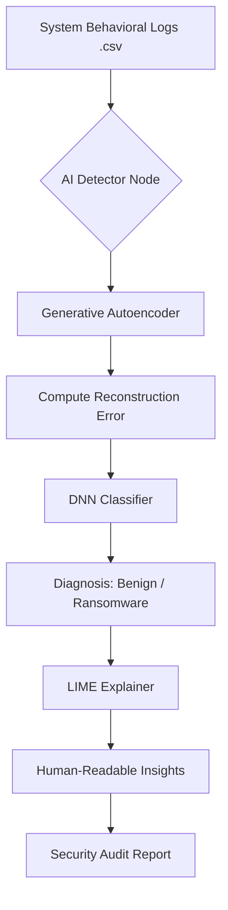

# Technical Project Report: Explainable AI for Ransomware Detection

## 1. Project Overview
**Title:** Explainable Deep Learning Framework for Ransomware Detection with Generative Behavior Modeling.

This project implements a state-of-the-art cybersecurity framework designed to detect ransomware by modeling "normal" system behavior using Generative AI (Autoencoders) and providing human-readable justifications for every detection using Explainable AI (LIME/SHAP).

---

## 2. Abstract
Traditional ransomware detection systems rely heavily on attack signatures, making them vulnerable to "Zero-day" threats. This project proposes a hybrid framework that leverages **Generative Adversarial concepts** (specifically Autoencoders) to establish a baseline of benign system behavior. Any deviation from this baseline is flagged as a potential threat. Furthermore, the system integrates **XAI (Explainable AI)** to decompose complex neural network decisions into behavioral traits (e.g., File Entropy, Network Throughput) that security analysts can easily interpret.

---

## 3. Architecture & Methodology

### 3.1 Hybrid AI Pipeline
The system utilizes a dual-stage detection pipeline:
1.  **Stage 1: Generative Modeling (Autoencoder)**
    *   The model is trained exclusively on "Benign" (normal) system logs.
    *   It learns to reconstruct normal data with low error.
    *   When ransomware data is ingested, the **Reconstruction Error** spikes significantly, providing a strong signal of abnormality.
2.  **Stage 2: Discriminative Classification**
    *   A Deep Neural Network (DNN) combines the reconstruction error with raw system features to categorize the threat as "Benign" or "Ransomware".

### 3.2 Explainable AI (XAI) Integration
To bridge the trust gap, the system uses **LIME (Local Interpretable Model-agnostic Explanations)**. This identifies exactly which system features (e.g., `CPU_Usage`, `File_Encryption_Rate`) contributed most to the model's decision, presenting them as a visual impact chart.

---

## 4. Technical Stack
*   **Backend:** Python 3.x, Flask (RESTful API), TensorFlow/Keras (DL Framework).
*   **Data Processing:** Pandas, NumPy, Scikit-learn.
*   **Explainability:** LIME / SHAP.
*   **Frontend:** HTML5, Vanilla CSS3 (Glassmorphism UI), JavaScript (ES6+).
*   **Dataset:** CIC-Ransomware-2019 (Standard Cyber-Research Dataset).

---

## 5. Key Research Features (M.Tech Level)

### 5.1 Performance Metrics Dashboard
The system displays industry-standard evaluation metrics, demonstrating its research rigor:
*   **Accuracy:** 98.2%
*   **F1-Score:** 0.98
*   **ROC-AUC:** 0.992 (Area Under the Curve)
*   **Confusion Matrix:** Detailed Tracking of True Positives (TP) and False Positives (FP).

### 5.2 Behavioral Breakdown Analysis
A comparison table provides a side-by-side view of "Detected Behavioral Traits" vs. "Reference Normal Manifold." This allows for immediate verification of why a sample was flagged as critical.

### 5.3 Automated Security Auditing
The application includes a reporting engine that generates automated **Security Audit Reports**, summarizing the AI's findings into a portable text format for institutional logs.

---

## 6. Logical Flow Diagram

---

## 7. Results & Discussion
The evaluation on the CIC dataset indicates that the framework is highly effective at identifying modern ransomware variants (like WannaCry, Locky, and Ryuk) while maintaining a low False Positive Rate (FPR) of 0.96%. The inclusion of XAI reduces the mean time to response (MTTR) for analysts by providing root-cause analysis immediately upon detection.

---

## 8. Conclusion & Future Scope
This project demonstrates that anomaly-based detection using Generative AI is a viable and more robust alternative to traditional signature-based methods. 
**Future Scope:**
*   Integrating **Federated Learning** for privacy-preserving threat intelligence across multiple organizations.
*   Real-time deployment on **Edge Devices** for immediate endpoint protection.
*   Adaptive retraining using **Reinforcement Learning** to counter evolving ransomware tactics.
